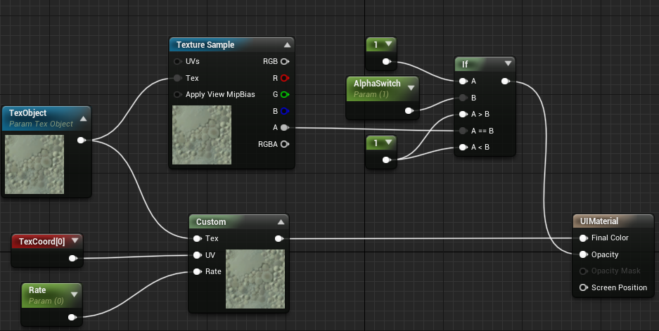
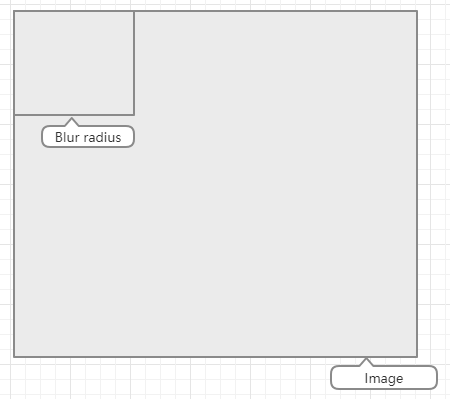
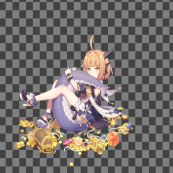
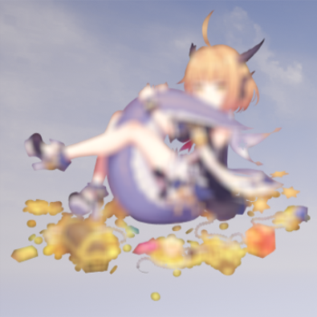
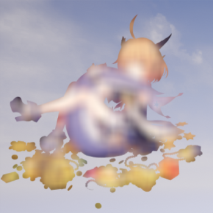
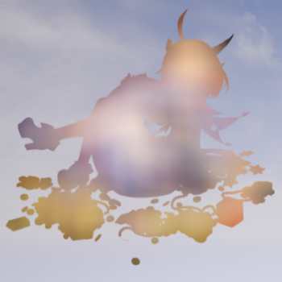
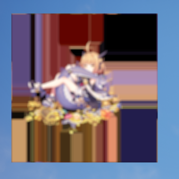
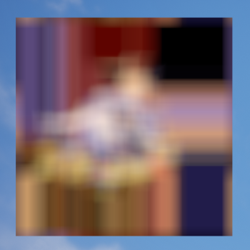

# HiImageBlur_unreal

### Why do this
Unreal build-in Background Blur can't achieve the effect we want, so write this by self.

- Can control whether blur whole image or some part of the image.
- Special effect by blur image pixel's some RGB channels.

### How to do this
- Create UI material
- Write shader code to process image pixels
- Create dynamic material at runtime
- Modify paramater of this dynamic material
- Create slate brush and use this dynamic material
- Create SImage and use this slate brush

--------------------
Create UI material:



Shader in custom node is:
``` c++
float3 blur = Texture2DSample(Tex, TexSampler, UV);
if(Rate > 0 && Rate < 1)
{
    float2 dim;
    Tex.GetDimensions(dim.x, dim.y);
    float radius = Rate*dim.x;
    int count = 0;
    for (int i = -radius; i < radius; i++)
    {
        for(int j=-radius;j<radius;j++)
        {
            float2 uvOffset = UV+float2(i/dim.x,j/dim.y);
            if(uvOffset.x>0&&uvOffset.y>0&&uvOffset.x<dim.x&&uvOffset.y<dim.y)
            {
                count+=1;
                blur += Texture2DSample(Tex, TexSampler,uvOffset);
            }
        }
    }
    blur/=count;
}
return blur;
```
Will recalculate image's pixel by UV moving as below:



Create dynamic material and set image brush:

``` c++
	UTexture* Texture = LoadObject<UTexture>(GetTransientPackage(), TEXT("/Game/TestTexture.TestTexture"));
	UMaterial* Material = LoadObject<UMaterial>(GetTransientPackage(), TEXT("/Game/UIMaterial.UIMaterial"));
	UMaterialInstanceDynamic* MaterialDynamic = UMaterialInstanceDynamic::Create(Material, GetTransientPackage());
	MaterialDynamic->SetTextureParameterValue(TEXT("TexObject"), Texture);
	MaterialDynamic->SetScalarParameterValue(TEXT("Rate"), 0.2);
	// MaterialDynamic->SetScalarParameterValue(TEXT("AlphaSwitch"), 1);
	// MaterialDynamic->SetScalarParameterValue(TEXT("AlphaSwitch"), 0);
	
	FSlateBrush Brush = FSlateBrush();
	Brush.SetResourceObject(MaterialDynamic);
	TestImage->SetBrush(Brush);
```

### Finally



---------------
Support: hiramtan@qq.com
